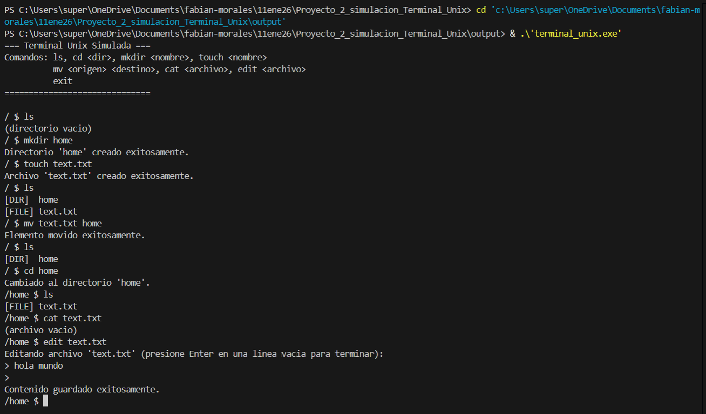

# Proyecto 2 simulacion de Terminal Unix

> Este proyecto consiste en una implementación completa de una terminal Unix simulada desarrollada exclusivamente en C++ utilizando únicamente la librería iostream, donde se ha diseñado un sistema de archivos jerárquico mediante estructuras de datos dinámicas personalizadas como listas enlazadas de caracteres para representar nombres y contenido, evitando completamente el uso de arreglos y bibliotecas estándar de manejo de strings, logrando así una solución que cumple con restricciones académicas específicas mientras proporciona funcionalidades esenciales como navegación entre directorios, creación de archivos y carpetas, movimientos y renombrado de elementos, y un editor de texto básico con persistencia en memoria.

    



### Descripción Adicional del Proyecto y sus Características
Este proyecto implementa un sistema de terminal Unix completo que simula un entorno de línea de comandos para la gestión de un sistema de archivos virtual. La solución destaca por su arquitectura única que utiliza exclusivamente estructuras de datos dinámicas personalizadas, evitando cualquier dependencia de bibliotecas estándar de C++ para manejo de cadenas y contenedores. El sistema permite la creación, navegación, modificación y organización jerárquica de archivos y directorios, incluyendo un editor de texto integrado que soporta múltiples líneas. Todas las rutas funcionan tanto en formato absoluto como relativo, y la implementación garantiza la liberación adecuada de memoria mediante funciones recursivas de limpieza.

### Características Principales:

- Sistema de archivos jerárquico con soporte para carpetas y archivos de texto

- Comandos Unix completos: ls, cd, mkdir, touch, mv, cat, edit, exit

- Rutas absolutas y relativas con navegación mediante "..", "." y "/"

- Editor de texto integrado para crear y modificar contenido de archivos

- Operaciones de movimiento y renombrado que preservan la estructura jerárquica

- Gestión de memoria manual sin fugas de memoria

- Interfaz de usuario intuitiva con prompt dinámico que muestra la ruta actual

## Construido Con
### Lenguajes Principales

- C++ (estándar, sin extensiones específicas)

### Tecnologías Utilizadas

- Solo iostream para entrada/salida básica

- Estructuras de datos dinámicas personalizadas (listas enlazadas)

- Programación estructurada

- Gestión manual de memoria (new/delete)

### Restricciones Implementadas:

✅ Sin uso de arreglos (arrays)

✅ Sin bibliotecas estándar de strings o contenedores

✅ Solo librería iostream permitida

✅ Todas las estructuras implementadas manualmente

### Comenzando

Esta es una guía para configurar y ejecutar el proyecto localmente.

### Prerrequisitos

- Compilador de C++ (g++, clang++, o MSVC)

- Sistema operativo: Cualquier sistema que soporte C++ (Windows, Linux, macOS)

- Editor de código (opcional pero recomendado: Visual Studio Code)

- Terminal/Consola para ejecución

### Configuración

- Clonar el repositorio (si aplica)

> bash
```
git clone <url-del-repositorio>
cd <nombre-del-directorio>
```

### Instalación

No se requiere instalación de dependencias externas. El proyecto es autocontenido en un solo archivo.

## Uso

### Compilar el programa:

>bash

```
g++ -o terminal_unix terminal_unix.cpp
```

o con clang:

>bash

```
clang++ -o terminal_unix terminal_unix.cpp
```

### Ejecutar el programa:

>bash
```
./terminal_unix
```

### Comandos disponibles:

>text
```
ls                     - Listar contenido del directorio actual
cd <ruta>             - Cambiar directorio (soporta rutas absolutas y relativas)
mkdir <nombre>        - Crear nueva carpeta
touch <nombre>        - Crear nuevo archivo
mv <origen> <destino> - Mover/renombrar archivo o carpeta
cat <archivo>         - Mostrar contenido de archivo
edit <archivo>        - Editar contenido de archivo
exit                  - Salir del programa
```

### Ejecutar Pruebas

Actualmente no hay un sistema de pruebas automatizado implementado. Se recomienda probar manualmente los comandos:

### Prueba básica de navegación:

>text
```
mkdir prueba
cd prueba
touch archivo.txt
ls
```

### Prueba de editor:

>text

```
edit archivo.txt
[Escribir contenido y terminar con línea vacía]
cat archivo.txt
```

### Prueba de movimientos:

>text
```
mv archivo.txt nuevo_nombre.txt
ls
```

### Despliegue

Este es un programa de consola autocontenido que no requiere despliegue en servidores. Simplemente:

- Compilar en el sistema destino

- Ejecutar el binario generado

- El programa funciona completamente en memoria, sin requerir archivos externos ni configuración

> Nota: Al salir del programa (comando exit), toda la estructura de archivos creada se pierde ya que está almacenada solo en memoria. Una extensión futura podría incluir persistencia en disco.

👤 **Fabian Morales**

- GitHub: [@fabax360](https://github.com/fabax360)

## 🤝 Contribuciones

¡Agradecemos sus contribuciones, problemas y solicitudes de funciones!

No dude en consultar la [issues page](../../issues/).

## Muestra tu apoyo

¡Dale un ⭐️ si te gusta este proyecto!

## Acknowledgments

- A mi familia
- A Dios ante todo

## 📝 Licencia

Este proyecto tiene la licencia [CC0 1.0 Universal](LICENCIA).
